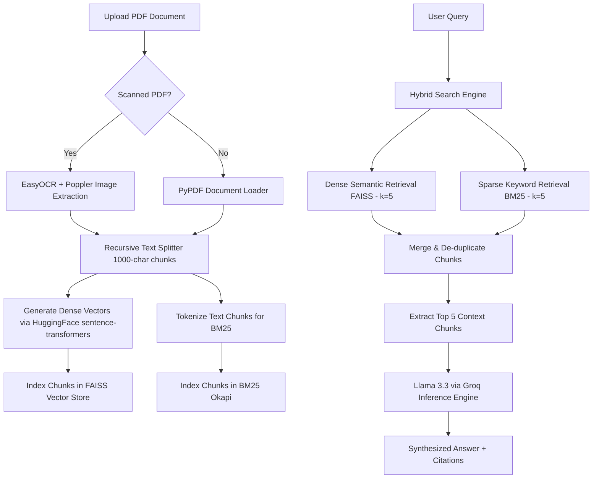

# 🚀 AlgoDocs: Enterprise Hybrid RAG & Cognitive Intelligence Workspace

AlgoDocs is a high-performance, containerized **Hybrid Retrieval-Augmented Generation (RAG)** platform designed to ingest, index, and query dense and sparse information from enterprise PDF documents. The system integrates semantic vector space retrieval with traditional keyword-based relevance matching, and automatically falls back to an OCR pipeline for scanned or image-based PDFs.

The workspace features a gorgeous, responsive, glassmorphic React frontend alongside a robust FastAPI backend. It is fully containerized using Docker and is deployed on AWS EC2.

---

## 📸 Interface Preview & Design System

The AlgoDocs frontend is designed with premium aesthetics in mind:
* **Glassmorphic Cards:** High-contrast containers utilizing blurred backdrops (`backdrop-blur-md`) and subtle white border overlays.
* **Dynamic Mesh Background:** A custom dark-theme mesh background animated with vibrant moving radial gradient orbs.
* **Interactive Chat Console:** Clean chat bubble components (indigo/dark glass gradients) complete with real-time AI typing indicators.
* **Drag-and-Drop Ingestion:** A visual file drop-zone that transitions to a green success state once a PDF is successfully uploaded.

---

## ⚙️ Architecture & Pipeline Flow

The system employs a multi-stage ingestion, indexing, retrieval, and synthesis pipeline:



### 1. Ingestion Pipeline
* **Normal PDF Ingestion:** Uses LangChain's `PyPDFLoader` to read structural document streams.
* **OCR Fallback Ingestion:** If the extracted text has a character count `< 50` (denoting scanned images or rasterized text), it automatically converts the PDF pages into high-resolution JPG images using `pdf2image` (backed by `Poppler`), then extracts clean text using `EasyOCR`.

### 2. Hybrid Retrieval Engine
* **Dense Semantic Search:** Mapped with `sentence-transformers/all-MiniLM-L6-v2` embeddings, creating dense vector representations of chunks indexed inside a local `FAISS` database.
* **Sparse Keyword Search:** Uses `BM25Okapi` to perform precise lexical matching, ensuring acronyms, product serial numbers, and specific terminology are not lost.
* **De-duplication & Routing:** Merges results from both retrievals, removes duplicates, takes the top 5 highest-relevance passages, and passes them to Llama 3.3 on Groq.

---

## 🛠️ Technology Stack

| Layer | Technologies / Frameworks Used |
| :--- | :--- |
| **Frontend** | React (Vite), Tailwind CSS, Vanilla CSS Glassmorphism, SVG Icons |
| **Backend** | FastAPI, Uvicorn, Python 3.10-slim |
| **Database & Auth** | MongoDB Atlas, Custom Vite middleware-plugin auth utilizing `MongoClient` |
| **RAG & AI Core** | LangChain, FAISS (CPU Vector DB), Rank-BM25, HuggingFace embeddings |
| **Extraction & OCR** | EasyOCR, pdf2image, Poppler-utils, PyPDF, pypdf Reader |
| **Deployment** | Docker, AWS EC2 |

---

## 📁 Directory Structure

```text
Enterprise_rag_application/
├── Backend/
│   ├── faiss_db/                 # Locally stored FAISS vector database
│   ├── uploads/                  # Temporary cache for uploaded PDF documents
│   ├── app.py                    # Core FastAPI RAG application & endpoints
│   ├── bm25.pkl                  # Serialized BM25 Okapi model index
│   ├── Dockerfile                # Production Docker container layout
│   ├── requirements.txt          # Python dependencies
│   └── README.md                 # Backend documentation
├── Frontend/
│   └── enterprise-rag-frontend/  # Vite + React Frontend project
│       ├── src/
│       │   ├── App.jsx           # Main Dashboard and Login Screens
│       │   ├── index.css         # Styling, glassmorphic filters, and mesh background
│       │   └── main.jsx          # Entrypoint
│       ├── vite.config.js        # Vite config with MongoDB Auth Server custom plugin
│       ├── package.json          # Node dependencies
│       └── README.md             # Frontend template README
└── README.md                     # Master Repository Documentation (this file)
```

---

## 🚀 Installation & Local Setup

### 1. Prerequisites
Ensure you have the following installed on your machine:
* **Node.js** (v18+)
* **Python** (v3.10+)
* **Docker** (optional, for containerization)
* **Poppler** (required for OCR on Windows/macOS/Linux)
  * *Windows Setup:* Place Poppler binaries in your local drive and update the `POPPLER_PATH` variable inside `Backend/app.py` (currently configured to `K:\Release-26.02.0-0\poppler-26.02.0\Library\bin`).
  * *Ubuntu/Debian Setup:* `sudo apt-get install poppler-utils`

### 2. Configure Environment Files

#### **Backend Environment Setup (`Backend/.env`)**
Create a `.env` file in the `Backend/` directory:
```env
GROQ_API_KEY=your_groq_api_key_here
```

#### **Frontend Environment Setup (`Frontend/enterprise-rag-frontend/.env`)**
Create a `.env` file in the `Frontend/enterprise-rag-frontend/` directory:
```env
MONGODB_URI=your_mongodb_connection_string_here
```

---

### 3. Running the Backend

#### **Option A: Local Virtual Environment**
Navigate to the `Backend` directory, activate a virtual environment, and run:
```bash
cd Backend
python -m venv venv
# Windows:
.\venv\Scripts\activate
# macOS/Linux:
source venv/bin/activate

pip install -r requirements.txt
# Run the application
uvicorn app:app --host 0.0.0.0 --port 8000 --reload
```

#### **Option B: Run with Docker**
To build and run the backend as a container:
```bash
cd Backend
docker build -t algodocs-backend .
docker run -p 8000:8000 --env-file .env algodocs-backend
```

---

### 4. Running the Frontend

Navigate to the frontend directory, install packages, and start the development server:
```bash
cd Frontend/enterprise-rag-frontend
npm install
npm run dev
```
The application will start at `http://localhost:5173`. 

---

## 📡 API Endpoints (Backend)

The FastAPI server exposes the following main endpoints:

### `GET /`
Returns a simple JSON welcome message showing backend availability.

### `POST /upload`
Uploads a new document to the workspace.
* **Payload:** Multipart Form Data (`file` as PDF).
* **Process:** Checks for OCR necessity, extracts text, splits text into 1000-char chunks, creates and stores the FAISS vector database locally (`faiss_db`), and serializes the BM25 model (`bm25.pkl`).
* **Response:**
  ```json
  {
    "status": "success",
    "chunks_created": 42,
    "file": "Autonomous-Vehicles.pdf"
  }
  ```

### `GET /ask`
Queries the hybrid retrieval engine for answers from the uploaded document.
* **Parameters:** `query` (string)
* **Process:** Retrieves top dense/sparse results, filters duplicates, formats Groq prompt context, gets synthesis response from Llama 3.3.
* **Response:**
  ```json
  {
    "question": "What is the safety rate?",
    "answer": "According to page 4 of the document, safety metrics show...",
    "sources": ["uploads/Autonomous-Vehicles.pdf page 3"]
  }
  ```

### `GET /health`
Returns a healthy probe for orchestration engines.
* **Response:** `{"status": "healthy"}`

---

## 🛡️ Authentication Flow (Vite + MongoDB Plugin)

Instead of spinning up a separate auth microservice for development, the project employs a highly innovative custom Vite plugin (`mongodbAuthPlugin`) inside `vite.config.js`.

When a client hits `/api/auth/signup` or `/api/auth/login`:
1. The Vite middleware intercepts the request.
2. It parses the body using raw request stream listeners.
3. It directly initiates a connection to **MongoDB Atlas** using `MongoClient`.
4. It verifies credentials or inserts new user documents into the `algodocs_db.users` collection.
5. This allows seamless local prototyping without backend CORS complexity or additional routing.

---

## 📝 License & Authors

* **Author:** Kishor Kumar Sahoo
* **Purpose:** Enterprise-grade cognitive document search engine and intelligence platform.
